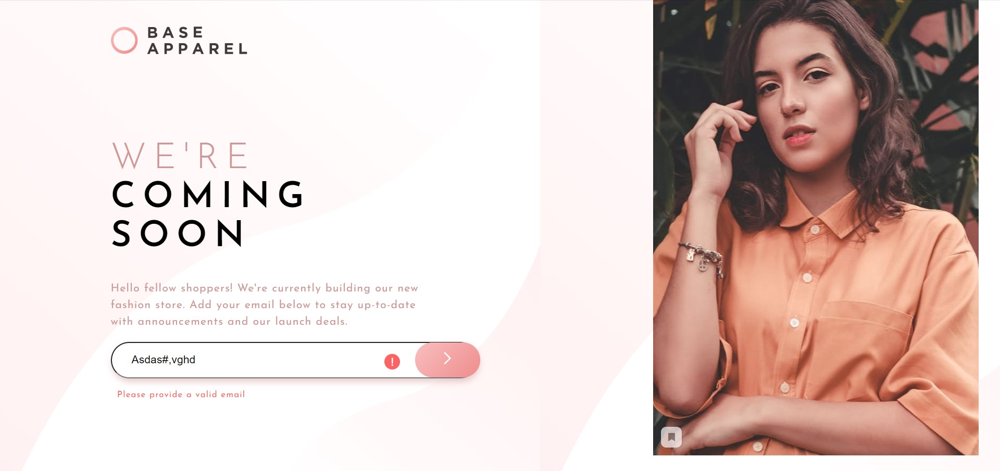
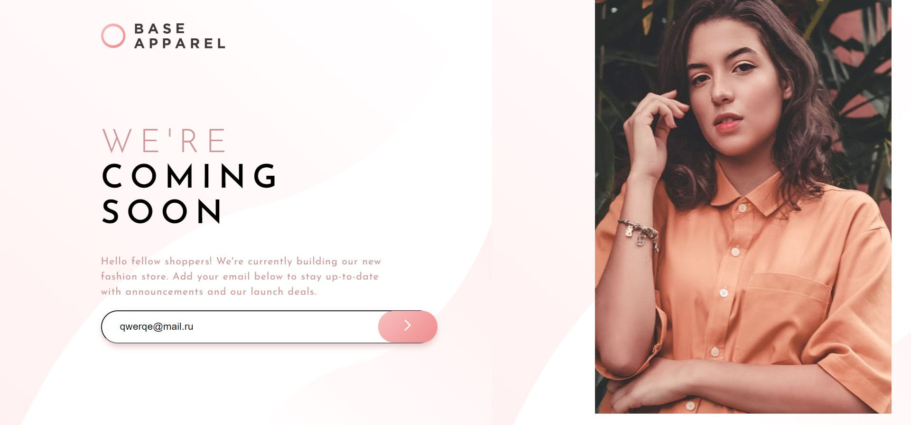

# Practice-1
## Table of Contents

- [Review] (#review)
- [Call] (#call)
- [Screenshot] (#screenshot)
- [Links] (#links)
- [My process] (#my-process)
- [Built-in] (#built-in)
- [What I learned] (#what-I-learned)
- [The continued development] (#continue development)
- [Useful resources] (#useful resources)
- [Author] (#author)


## Overview

This project was taken from the website https://www.frontendmentor.io . And it is made as hoosho as possible.

### Challenge

Users should be able to:

- View the optimal layout of the site depending on the screen size of their device
- See hover states for all interactive elements on the page
- Receive an error message when submitting a "form" if:
- The "Input" field is empty
- The email address is incorrectly formatted

### Screenshot



### Links
- Live Site URL: (https://espalmaz.github.io/Prac-1/)

## My process

During the execution of this project, we started working with writing HTML code, since it is the basis from which we worked further. Then after that we made all the necessary changes using CSS. And also, at the end of the work, JAVASCRIPT functions were added.

### Built with

- HTML5 semantic markup
- Custom CSS properties
- CSS container
-Links to fonts
-Forms with text and a button
-Replacing the button with a picture


###What I learned


In the process of doing this work, we have deepened our knowledge of HTMl, CSS and Javascript. We also studied new functions of these programming languages. For example, we learned how to replace a button with a picture. Also connect various fonts from the Internet. Set colors using a gradient. We also learned the functions thanks to which you can check the spelling of the email address, as well as the functions that can add a class to CSS. In most cases, we improved our skills with these programming languages.

These are examples from our code that are the most successful and new to us:

```html
<button type="submit">

</button>
```
```css
@import url('https://fonts.googleapis.com/css2?family=Josefin+Sans:wght@300;400;600&display=swap');
body {
background-color: #FFF5F5;;
font-family: 'Josefin Sans', sans-serif;
padding: 0;
margin: 0;
display: block;
}
```
```js
function validateEmail (email) {
const re = /^(([^<>()\[\]\\.,;:\s@"]+(\.[^<>()\[\]\\.,;:\s@"]+)*)|(".+"))@((\[[0-9]{1,3}\.[0-9]{1,3}\.[0-9]{1,3}\.[0-9]{1,3}\])|(([a-zA-Z\-0-9]+\.)+[a-zA-Z]{2,}))$/;
return re.test(String(email).toLowerCase());
}
```


### Continued development

In the future, we are going to study various aspects of Javascript in more depth in order to add more and more features that will help our site become better. Also, the method of adding classes via javascript is very convenient, so we will especially study this method in order to decorate our upcoming works in the best way. ### Useful resources

-  (https://www.w3schools.com / - This resource was very useful in writing HTML code, although most of it was written without it, but in some moments it was very useful.
-  (https://www.javascript.com/learn ) - This site also helped a lot in writing Javascript code. Therefore, we recommend that when learning this language, look for information that will help here.

- (https://developer.mozilla.org/ru /) this resource also has a lot of useful articles on various topics , on this site we found answers to some of our questions.
## Author

- Website - [Tashimov Almaz and Rinatova Madina] (https://espalmaz.github.io/Prac-1/ )()
- Repository (https://github.com/EspALmaz/Prac-1.git)()
